## 1. Resumen del proyecto

En este proyecto construimos una red social enfocada en mujeres.
Nuestra Red Social  permite a cualquier usuaria crear una cuenta de
acceso y loguearse con ella; crear, editar, borrar y _"likear"_ publicacciones.

## 2. Investigación UX

La base de este proyecto fue centralizado en las necesidades de nuestras usuarias.En diseño, funcionaliadad y experiencia.
Las usuarias de este proyecto son mujeres que tienen como principal necesidad poder compartir  e intercambiar con otras mujeres sus pensamientos, ideas, sentimientos, logros, tips o hasta una vacantes de trabajo.

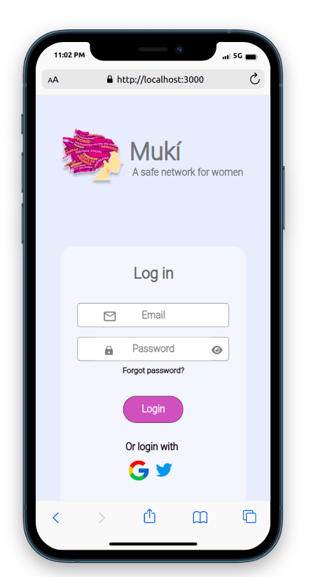
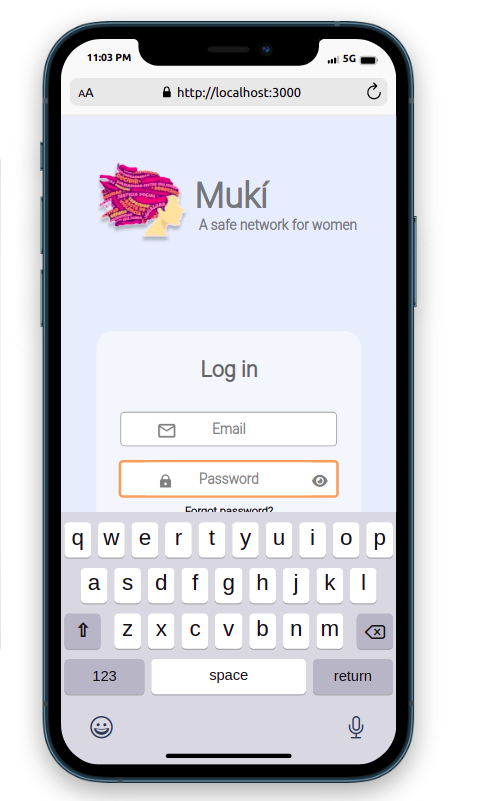
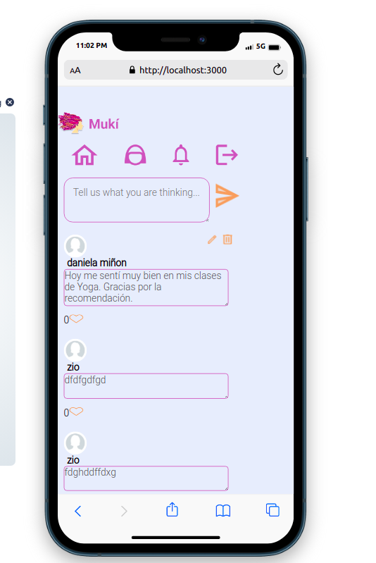
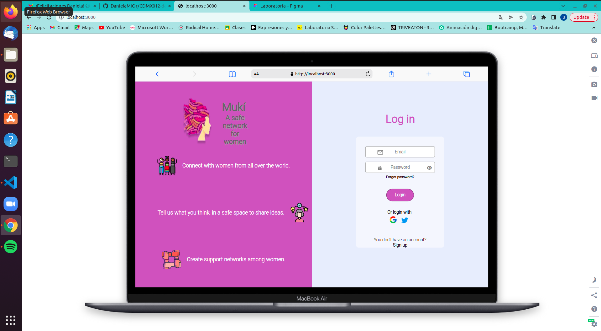
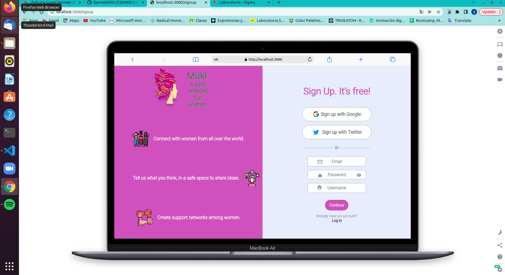
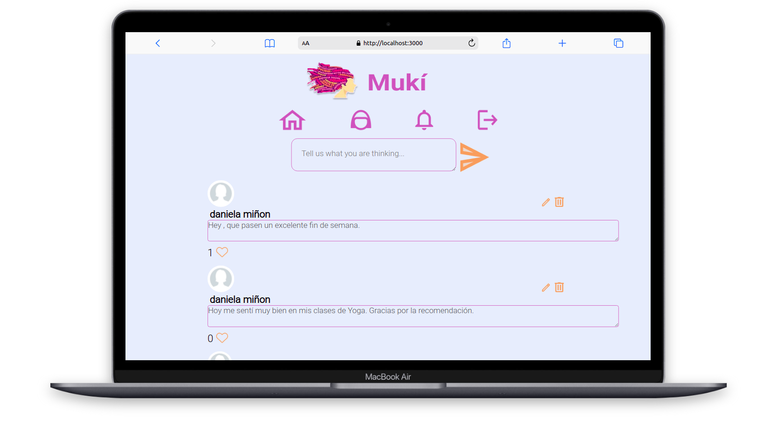
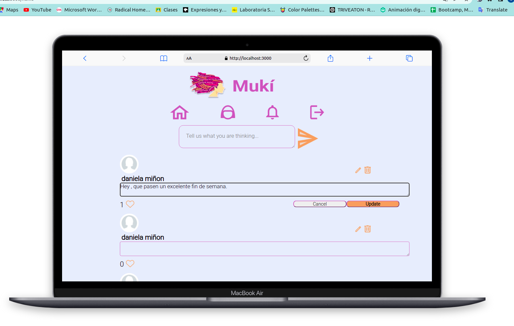
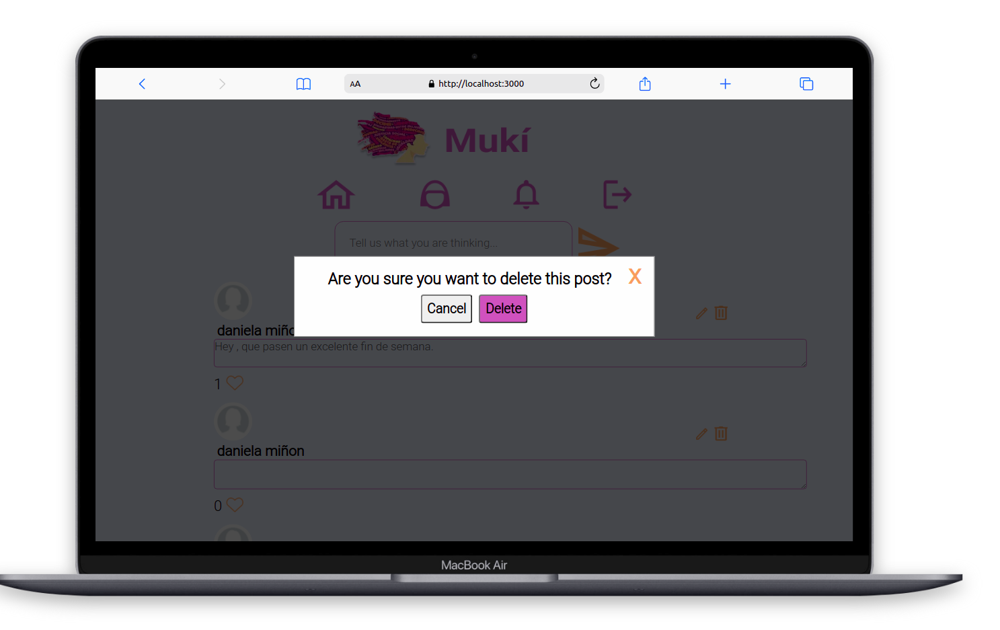

## 3. Comentarios básicos

Confome empezamos construir nuestros prototipos de la red social siempre estuvimos trabajando de la mano de las necesidades y sugerencias de usuarias, de nuestras compañeras y coaches. Los colores, la  organización y la implementación de loguearse con Google y Twitter. 
Intentamos siempre basarnos en el prototipo de alta fidelidad, cada avance de historia de usuaria realizamos test de usabilidad para tener una página intuitiva.

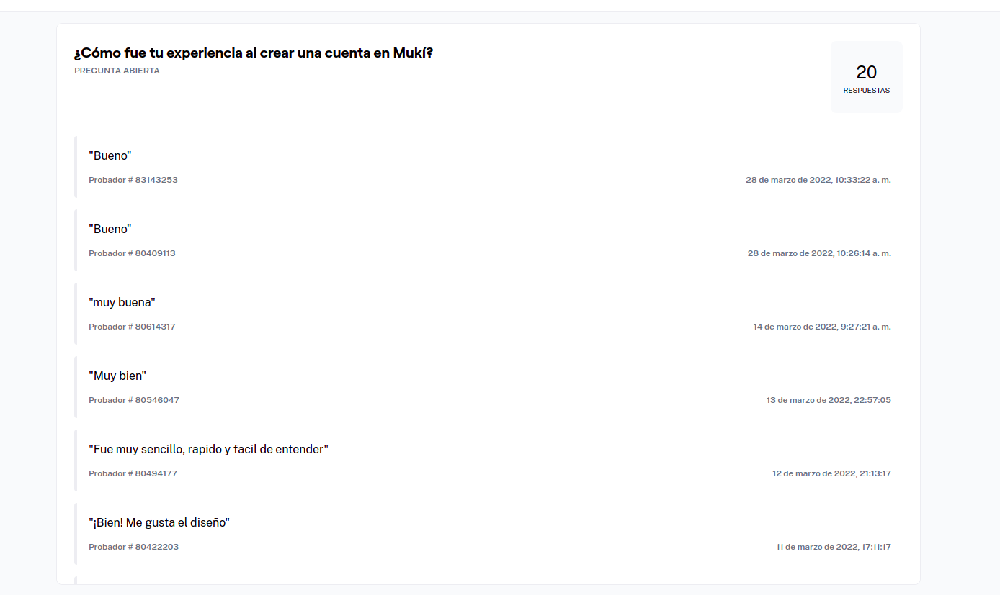
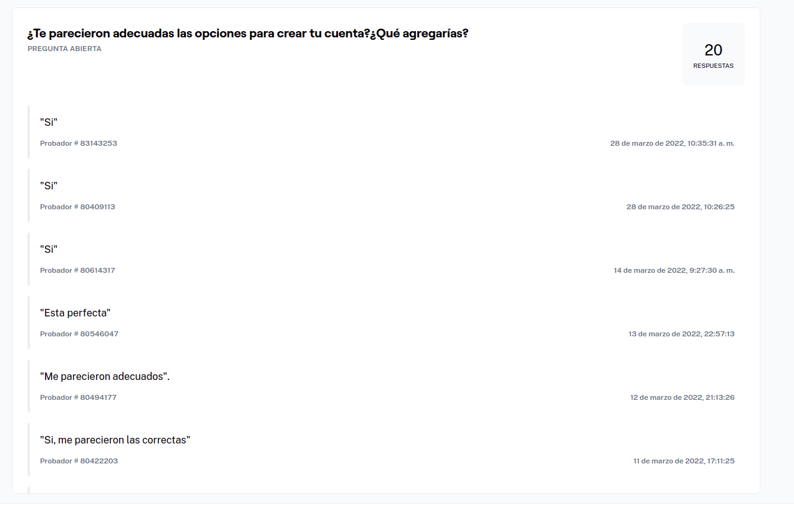
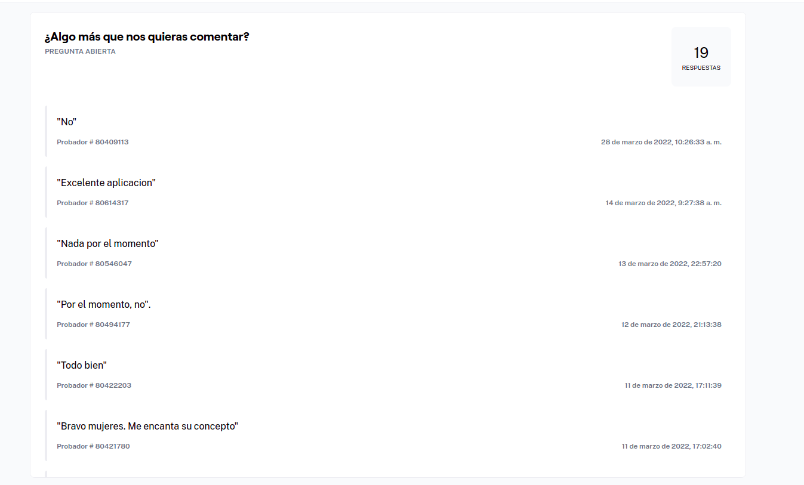

### 4.Boceto baja fidelidad

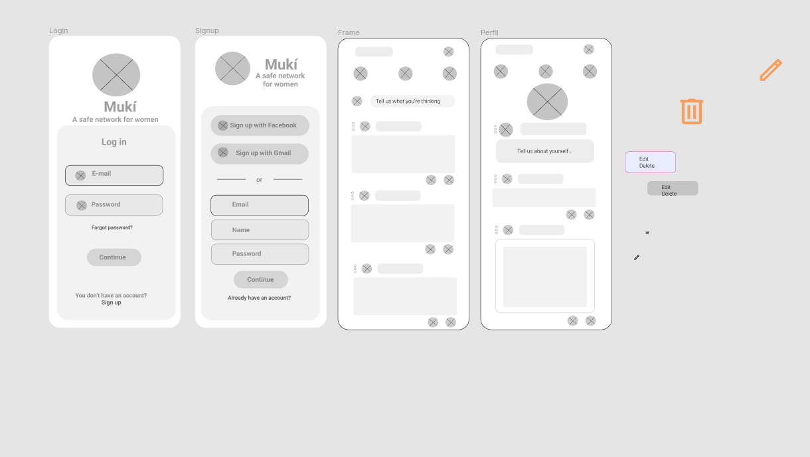

## 5. Prototipo en Figma

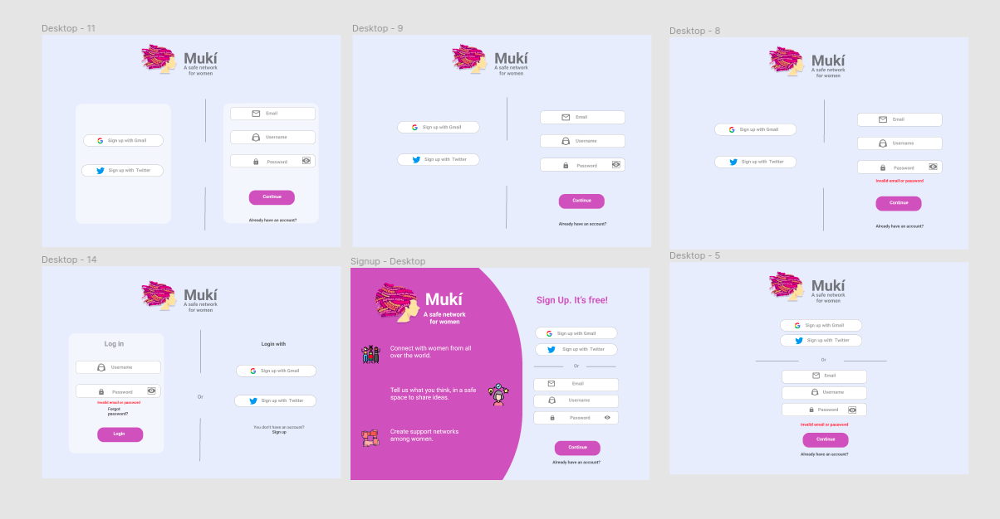
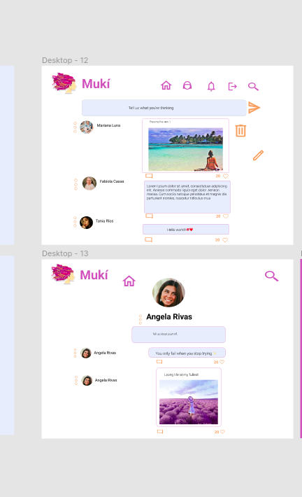

